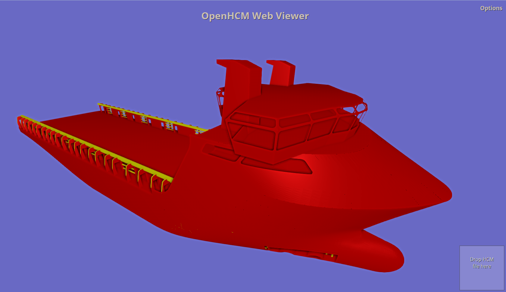

OpenHCM Web Viewer
==================

The OpenHCM Standard
--------------------
OpenHCM is an industry-driven XML-based file format to store ship structure and condition of the hull. The format is maintained and promoted by the OpenHCM Consortium which comprises several major class societies as well as CAD vendors and other technology leaders in the maritime industry. HCM stands for Hull Condition Model.
For more information on the format, please consult the [OpenHCM 2.0 schema](https://openhcmstandard.github.io/Data-Format/).

The Viewer
----------
The OpenHCM Web Viewer was developed by [Bureau Veritas](http://www.bureauveritas.com) in order to promote the format and demonstrate its features. It is now released under the [Apache License 2.0](http://www.apache.org/licenses/LICENSE-2.0) in order to encourage its use and evolution, as well as offer a sample implementation for future OpenHCM-supporting software.

Privacy
-------
The viewer does not store any of your data. Specifically, the HCM files you open with it are never uploaded to the server.

Technology
----------
The Viewer is written fully in HTML/CSS/JS and relies on several open-source libraries among which :
* [Three.js](http://threejs.org)
* [jQuery](https://jquery.com/) and [jQuery UI](https://jqueryui.com/)
* [Earcut](https://github.com/mapbox/earcut)
* [Dropzone.js](http://www.dropzonejs.com/)
* [Spin.js](http://spin.js.org)
* [jsTree](https://www.jstree.com/)
